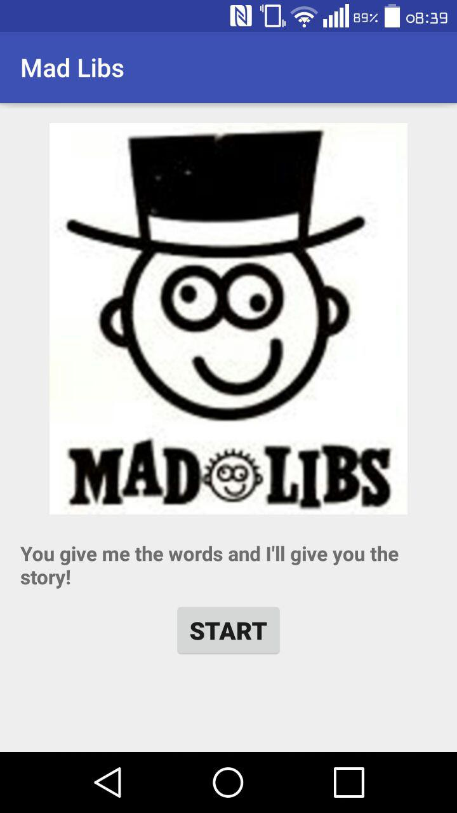
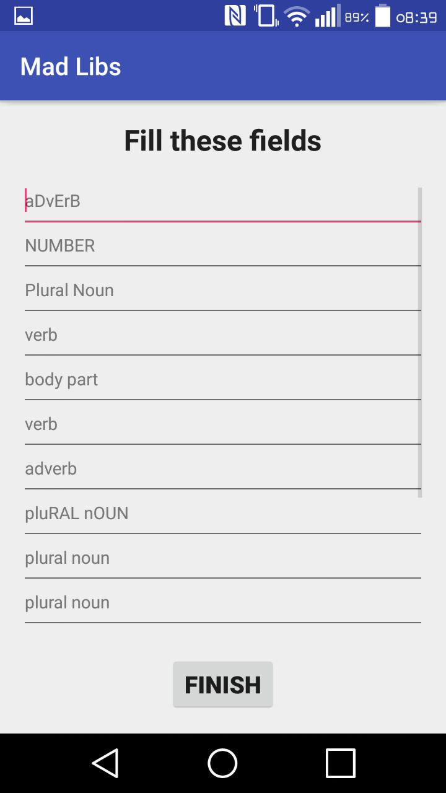

# DasyelWillems-pset2 (Mad Libs)
student: Dasyel Willems (10172548)
The second problem set app for Native Appstudio.
## Description
This app picks a random story from its story-files and asks the user to fill-in some of the
words before showing the completed story to the user.

## Screenshot

